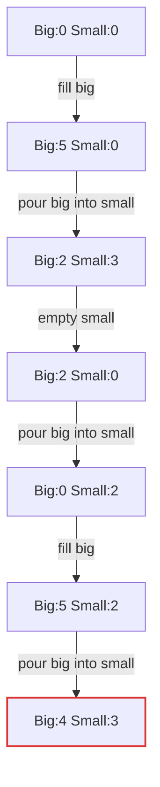

# TestSolvesThePuzzle

## invariant "big jug is never at 4" violated

Explored 13 states.

| # | action | state |
|--:|---|---|
| 0 | (init) | `Big:0 Small:0` |
| 1 | fill big | `Big:5 Small:0` |
| 2 | pour big into small | `Big:2 Small:3` |
| 3 | empty small | `Big:2 Small:0` |
| 4 | pour big into small | `Big:0 Small:2` |
| 5 | fill big | `Big:5 Small:2` |
| 6 | pour big into small | `Big:4 Small:3` |
