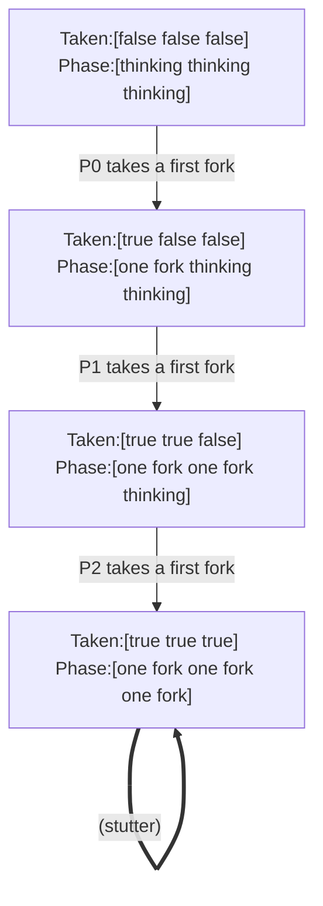

# TestNaiveProtocolDeadlocks

## liveness "everyone has eaten" violated

Explored 27 states.

| # | action | state |
|--:|---|---|
| 0 | (init) | `Taken:[false false false] Phase:[thinking thinking thinking]` |
| 1 | P0 takes a first fork | `Taken:[true false false] Phase:[one fork thinking thinking]` |
| 2 | P1 takes a first fork | `Taken:[true true false] Phase:[one fork one fork thinking]` |
| 3 | P2 takes a first fork | `Taken:[true true true] Phase:[one fork one fork one fork]` |
| 4 ↺ | (stutter) | `Taken:[true true true] Phase:[one fork one fork one fork]` |

The ↺ steps repeat forever.
