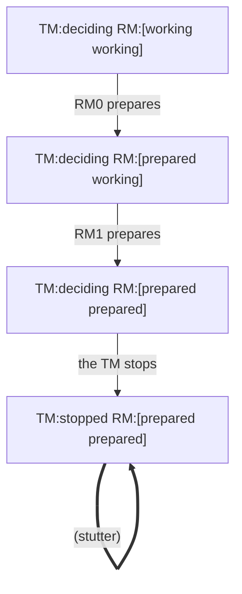

# TestAStoppedManagerBlocksThePrepared

## liveness "every resource manager decides" violated

Explored 31 states.

| # | action | state |
|--:|---|---|
| 0 | (init) | `TM:deciding RM:[working working]` |
| 1 | RM0 prepares | `TM:deciding RM:[prepared working]` |
| 2 | RM1 prepares | `TM:deciding RM:[prepared prepared]` |
| 3 | the TM stops | `TM:stopped RM:[prepared prepared]` |
| 4 ↺ | (stutter) | `TM:stopped RM:[prepared prepared]` |

The ↺ steps repeat forever.
