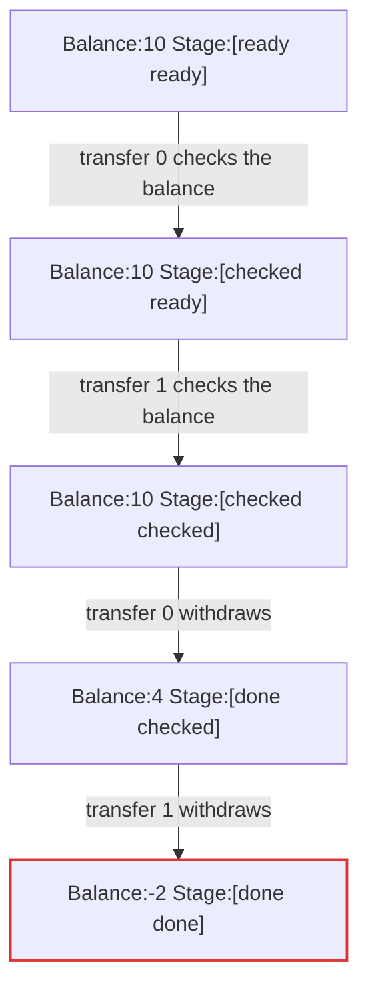

# TestSeparateCheckOverdraws

## invariant "the balance never goes negative" violated

Explored 9 states.

| # | action | state |
|--:|---|---|
| 0 | (init) | `Balance:10 Stage:[ready ready]` |
| 1 | transfer 0 checks the balance | `Balance:10 Stage:[checked ready]` |
| 2 | transfer 1 checks the balance | `Balance:10 Stage:[checked checked]` |
| 3 | transfer 0 withdraws | `Balance:4 Stage:[done checked]` |
| 4 | transfer 1 withdraws | `Balance:-2 Stage:[done done]` |
